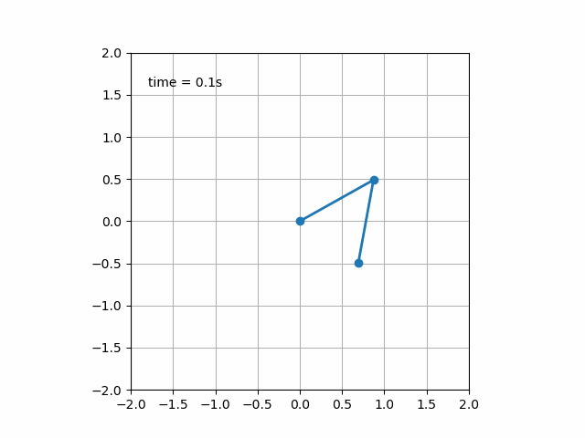

# Physics I

:hand: Hi there, this repository contains the scripts, practices and examples to Physics I class. Each folder called by unit include the programming scripts used in class and the computational physics laboratory practices. (animation from  <cite>https://matplotlib.org/2.1.2/gallery/animation/double_pendulum_animated_sgskip.html</cite>)

Spring course to groups:  
- S01E
- S01I

